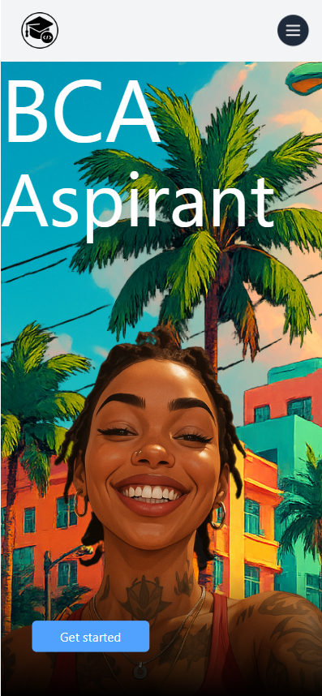
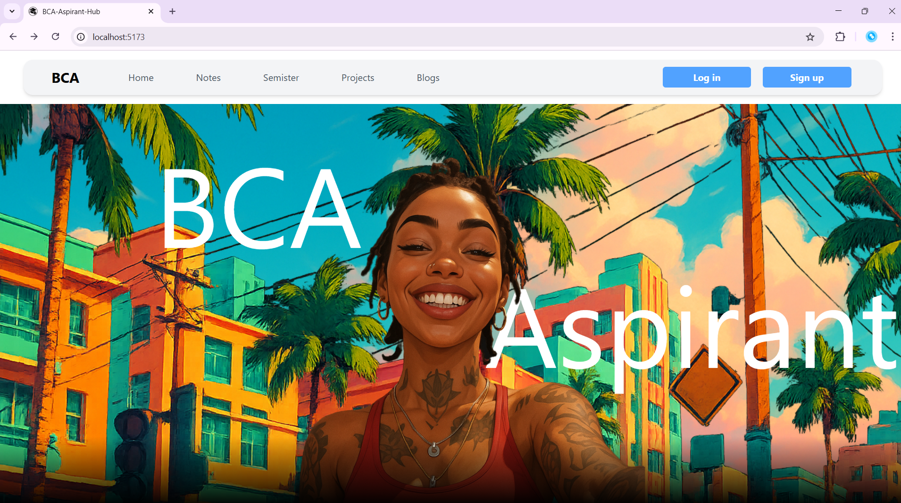

# 🎓 BCA Project – [BCA-Aspirant-Hub]

> 🚧 Work in Progress | Started: [2082-01-25]

This is my BCA project built with **React** and enhanced using animation libraries and UI tools. The project demonstrates modern frontend development practices using custom hooks, animations, and efficient component structures.

---

## 🧰 Tech Stack

- **React** – Frontend library
- **React Router DOM** – Page navigation and routing
- **Remixicon** – Icon library for elegant UI
- **Lucide-react** – Clean, consistent icons
- **GSAP** – Powerful animation library
- **Framer Motion** – Declarative animations for React
- **Oll** – [Clarify this if it's a typo or specific library]
- **Custom Hooks** – For logic reuse and cleaner code
- **Status Handling** – Better UX feedback and logic flow

---

## 🧑‍💻 Features

- 🔁 Smooth page transitions
- 🧠 Reusable and maintainable components
- 🛠️ Custom React Hooks for enhanced logic control
- ✨ Animations using **GSAP** and **Framer Motion**
- 🎨 Icons from **Remixicon** and **Lucide-react**
- 📱 Responsive and interactive design

---

## 🚀 Getting Started

```bash
git clone https://github.com/your-username/your-project-name.git
cd your-project-name
npm install
npm start
```
## Folder Structure
```bash
src/
├── assets/             # Images, SVGs, icons
├── components/         # Reusable UI components
├── hooks/              # Custom hooks
├── pages/              # Route-based pages
├── styles/             # CSS / SCSS modules or tailwind
├── App.js
└── main.jsx
```

## 📸 Screenshot in phone



## 📸 Screenshot in windows


# Notes section | page

## sem01

* Notes pdf
    - cfa
    - dl
* Books pdf
    - not yet

## sem02
* Notes pdf
    - not yet
* Books pdf
    - math